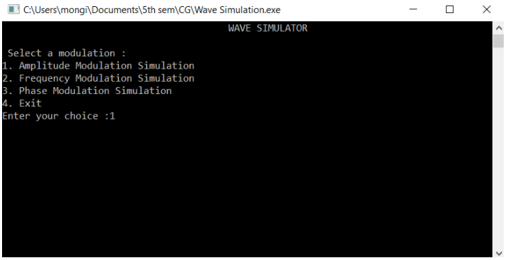
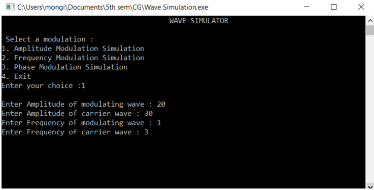
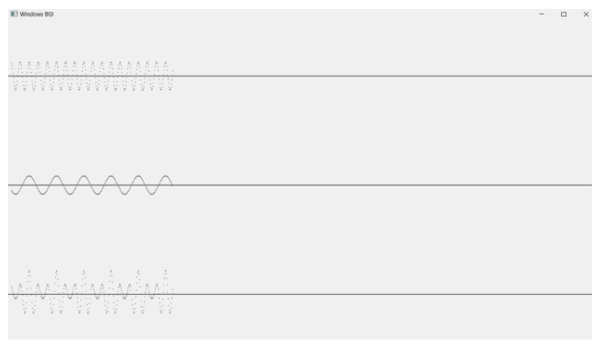
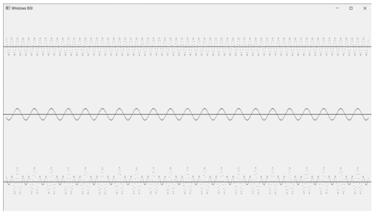
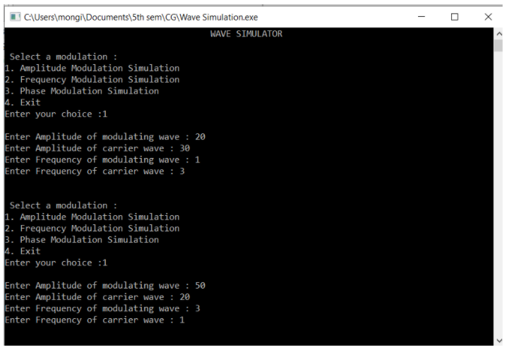
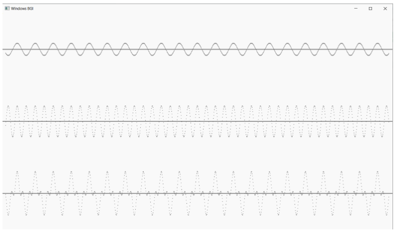

# Modulated Wave Simulator

## Modulation
A message carrying a signal has to get transmitted over a distance and for it to establish a reliable communication, it needs to take the help of a high frequency signal which should not affect the original characteristics of the message signal.
The characteristics of the message signal, if changed, the message contained in it also alters. Hence, it is a must to take care of the message signal. A high frequency signal can travel up to a longer distance, without getting affected by external disturbances. We take the help of such a high frequency signal which is called a carrier signal to transmit our message signal. Such a process is simply called Modulation.
Modulation is the process of changing the parameters of the carrier signal, in accordance with the instantaneous values of the modulating signal.

## Signals in the Modulation Process
Following are the three types of signals in the modulation process:
1. Message or Modulating Signal
The signal which contains a message to be transmitted, is called a message signal. It is a baseband signal, which has to undergo the process of modulation, to get transmitted. Hence, it is also called as the modulating signal.
2. Carrier Signal
The high frequency signal, which has a certain amplitude, frequency and phase but contains no information is called a carrier signal. It is an empty signal and is used to carry the signal to the receiver after modulation.
3. Modulated Signal
The resultant signal after the process of modulation is called a modulated signal. This signal is a combination of modulating signal and carrier signal.

## Project
The Modulated Wave Simulator is used to simulate the three different modulations viz., **Amplitude Modulation**, **Frequency Modulation**, **Phase Modulation**. The user is asked to input the various parameters required to simulate carrier and message signal. The program then generates the modulated signal. The project is built using the graphics.h library in c++.

### Screenshots

